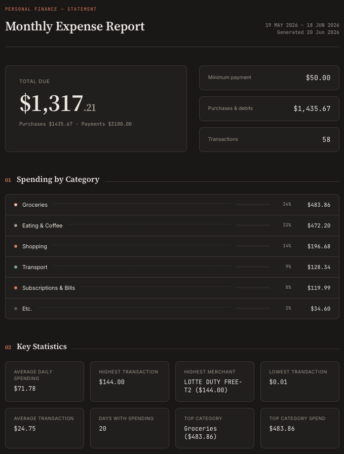

# cursor-use

**Personal agents on Cursor** — reusable automations for everyday tasks, starting with monthly expense reports.

Each use case lives in its own folder with scripts, config, and **skills** that tell cloud agents exactly what to run.

---

## expenses-tracker

Forward a bank PDF (or upload to R2) → a Cursor agent cleans the statement, verifies statistics, and publishes an HTML report.

<p align="center">
  <a href="expenses-tracker/README.md">
    
  </a>
</p>

<p align="center">
  <a href="expenses-tracker/README.md"><strong>Full docs →</strong></a>
</p>

```bash
uv sync
uv run expenses-tracker/scripts/process_bills.py
uv run expenses-tracker/scripts/clean_markdown.py draft   # agent cleans + stats
uv run expenses-tracker/scripts/clean_markdown.py push
uv run expenses-tracker/scripts/generate_report.py --force
```

**Monthly on Cursor Cloud Agents** — [API docs](https://cursor.com/docs/cloud-agent/api/endpoints):

```bash
export CURSOR_API_KEY="cursor_..." # pragma: allowlist secret
uv run expenses-tracker/scripts/setup_agent.py      # once
uv run expenses-tracker/scripts/trigger_monthly.py  # each month
```

Or use **Cursor Automations** in the dashboard (built-in cron, no API).

---

## Reusing this repo

1. **Fork** and push to your GitHub account.
2. **Configure** — edit `expenses-tracker/config.toml`, add R2 secrets to `.env` or Cloud Agents environment.
3. **Create the cloud agent** — `uv run expenses-tracker/scripts/setup_agent.py` (auto-detects your fork from `git remote`).
4. **Schedule** — GitHub Actions (`.github/workflows/monthly-expenses.yml`) or Cursor Automations UI.

Nothing is tied to a specific user: repo URL from your fork, categories from `config.toml`, secrets from env.

---

## Adding another personal agent

Copy the `expenses-tracker/` pattern:

| Piece | Purpose |
|-------|---------|
| `config.toml` | User-specific settings |
| `skills/` | Agent instructions |
| `scripts/setup_agent.py` + `trigger_*.py` | Cloud Agents API |
| `.github/workflows/*.yml` | External cron (API has no built-in schedule) |

Shared client: `expenses-tracker/lib/agent_api.py`
